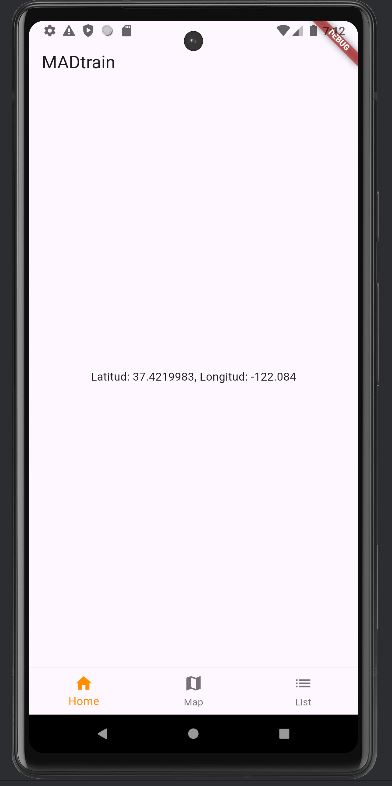
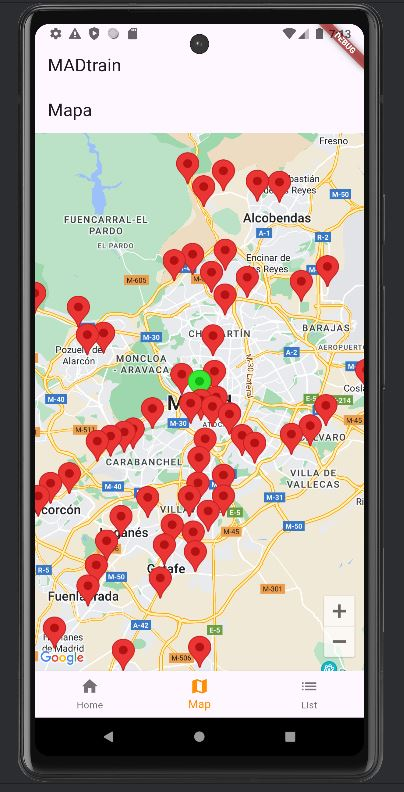
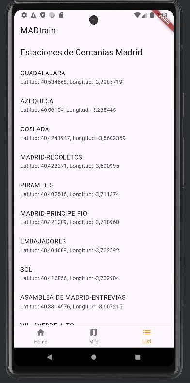

# MadTrain

## Workspace 
Github:  
- Repository: https://github.com/lauraszmigielska/MadTrainFlutter
- Releases:

  Final app: https://github.com/lauraszmigielska/MadTrainFlutter/blob/main/mad_train_flutter.zip

  Flutter class app: https://github.com/lauraszmigielska/MadTrainFlutter/blob/main/flutter_class_project.zip

  Firt app: https://github.com/lauraszmigielska/MadTrainFlutter/blob/main/flutter_class_project.zip

Workspace: https://upm365.sharepoint.com/sites/LauraSzmigielska/Documentos%20compartidos/Forms/AllItems.aspx

  

## Description
The MadTrainFlutter is a mobile application developed using Flutter, a framework for building cross-platform applications. It integrates Google Maps functionality to display train station locations based on data stored in a CSV file. The app allows users to view their current location on the map as well. Key features include:

- Displaying train station markers with specific colors (red for stations and green for the user's location).
- Interactive map navigation with support for different map types (e.g., normal view).
- Implementation of dynamic data handling using Dart language features and Flutter widgets.

## Screenshots and navigation

<table>
  <tr>
    <td>
      
      
Home

    </td>
    <td>
      
      
Map

    </td>
    <td>
      
      
List

    </td>
  </tr>
</table>

## Demo Video
Video demonstrating how the app works (Max 1 video of 1 minute), upload it to a platform like YouTube or Vimeo (it might also work with Stream) and link it here:  

## Features
1. Location-Based Search: Utilizes GPS to pinpoint the user's current location.

2. Interactive Map Display: Shows the locations of Renfe train stations on a Google Map for visual reference.

3. CSV Data Handling: Loads station data from a CSV file for displaying station information.

4. Custom Markers: Differentiates user location marker (green) and Renfe station markers (red) on the map.

5. Station List: Presents a list of Renfe stations retrieved from the CSV file.

6. Responsive UI: Provides a user-friendly interface for seamless navigation between the map view and station list.

7. Marker Interaction: Allows users to tap on station markers to view additional details or actions.

8. Location Permissions: Requests user permission to access location services for accurate functionality.

## List the **technical** features of the app.
1. CSV Data Handling:
Purpose: Loads and parses station data from CSV files.
Implementation: Utilizes Dart programming language's file handling capabilities to read CSV files and extract station information.

2. Google Maps Integration:
Purpose: Displays station locations and user's current location on an interactive map.
Implementation: Integrates Google Maps API with Flutter framework to render maps, place markers, and handle user interactions such as zoom and pan.

3. Location Services:
Purpose: Determines the user's current geographic coordinates using GPS.
Implementation: Requests and manages location permissions from the user's device using Flutter's location services plugins.

4. Marker Customization:
Purpose: Differentiates between user location marker and Renfe station markers on the map.
Implementation: Customizes marker icons and properties to visually distinguish between different types of markers (e.g., green for user location, red for Renfe stations).

5. Interactive User Interface (UI):
Purpose: Provides a responsive and intuitive UI for navigating between map view and station list.
Implementation: Implements Flutter widgets to create a smooth and user-friendly interface, ensuring seamless transitions and interactions between different screens.

6. Data Model (TrainStation):
Purpose: Represents the structure of a train station with attributes like name, latitude, longitude, etc.
Implementation: Defines a Dart class (TrainStation) to encapsulate station properties and methods for accessing and manipulating station data.

7. List View (Station List):
Purpose: Displays a list of Renfe stations retrieved from the CSV file.
Implementation: Utilizes Flutter's ListView widget along with data binding techniques to populate and display station names dynamically based on the loaded CSV data.

8. Error Handling:
Purpose: Manages and displays errors gracefully to users in case of issues like file reading errors or location service failures.
Implementation: Implements error-checking mechanisms and displays informative messages or fallback options to ensure a smooth user experience even under adverse conditions.

9.Responsive Design:
Purpose: Ensures the app's layout and functionality adapt seamlessly to different screen sizes and orientations.
Implementation: Uses Flutter's responsive design principles and widgets to maintain consistent UI elements and behavior across various devices.

10. Documentation and Maintenance:
Purpose: Ensures maintainability and scalability of the app.
Implementation: Includes comprehensive documentation within code comments, adheres to Flutter best practices, and uses version control (like Git) for managing changes and updates effectively.

## How to Use
Upon launching the app, users are prompted to grant location permissions.
Once permissions are granted, the app retrieves the user's current location using GPS.
In "Map" you can see your actual location and Renfe stations locations on the map.
In "List" you have a list of the Renfe stations.

## Target Audience:

The Renfe Station Locator app caters to commuters, travelers, and tourists who rely on Renfe trains for transportation. It helps users quickly identify nearby stations, facilitating easier navigation and trip planning.

## Compatibility:

The MadTrainFlutter app is designed and developed using Flutter, a framework known for its cross-platform capabilities. As a result, the app is compatible with a wide range of devices running different operating systems, including:

Android: Compatible with smartphones and tablets running Android OS.
iOS: Compatible with iPhones and iPads running iOS.
Web: Supports deployment as a progressive web app (PWA) for use in web browsers.

# Key Points:
Device Compatibility: The app adapts its UI and functionality to various screen sizes and resolutions typical of smartphones, tablets, and web browsers.

Operating System Support:
Android: Supports Android versions compatible with Flutter's current stable release.
iOS: Supports iOS devices running compatible versions of iOS supported by Flutter.

Consistent User Experience: Users can expect a consistent experience across different platforms, maintaining the same features and usability whether on Android devices, iOS devices, or accessing the app via a web browser.

Flutter's Benefits: Leveraging Flutter's single codebase approach, the app minimizes development effort and ensures simultaneous updates across all supported platforms, enhancing maintainability and user satisfaction.

Performance: Utilizes Flutter's native performance capabilities to deliver smooth animations, responsive UI interactions, and efficient data handling across platforms.

## Future Enhancements:

Future updates may include features such as real-time train schedules, notifications for service disruptions, and integration with other transportation services.

## Participants
List of MAD developers:
- Laura Szmigielska (laura.szmigielska@alumunos.upm.es) 

Workload distribution between members: Laura Szmigielska 100%
